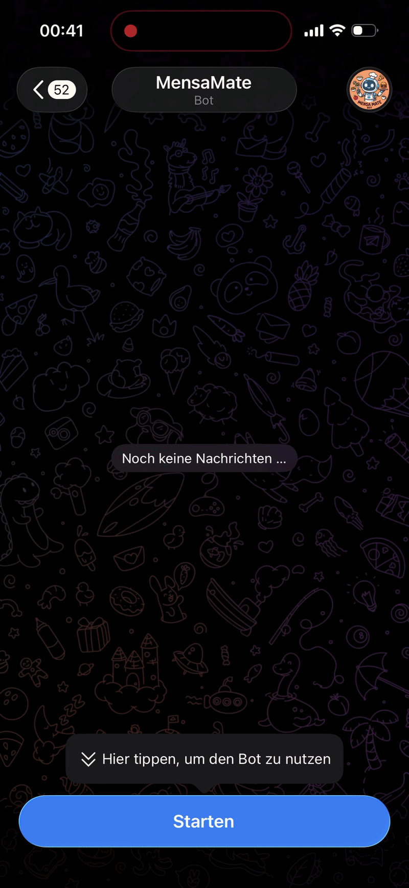

# MensaMate

MensaMate is a Telegram Bot, that shows you the Meals from your favorite canteen.

## Installation

You need Docker and Git to install MensaMate, then run:

### 1. Clone and prepare the Bot

```bash
# Clone the Repository
git clone https://github.com/0x4148-ahmad/MensaMate.git mensamate

# Go to the directory
cd mensamate

# Rename the .env
cp .env.example .env
```

### 2. Configure the Bot

Open the .env file, add your Telegram Bot Token and an Admin Chat ID (ID between the Bot and you)


### 3. Start the Bot
```bash
# Build and start the Container in the background
docker compose up -d --build
```

## Demo



## License
[MIT](LICENSE)